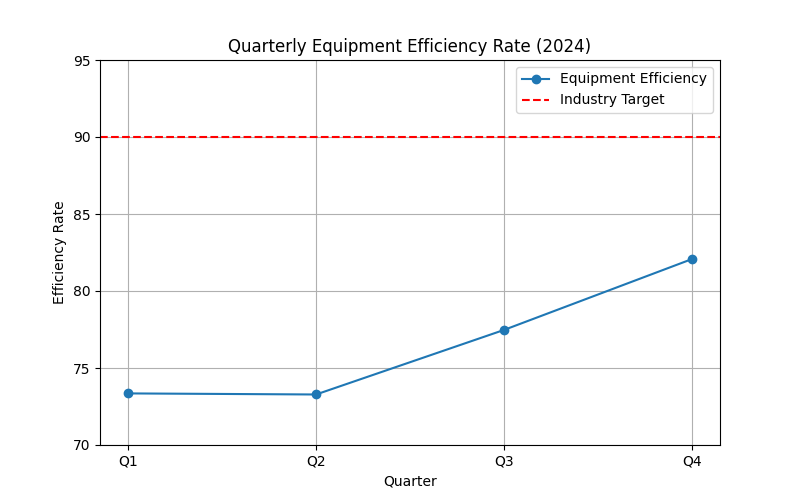

# Manufacturing Performance Analysis (2024)
# Email: 23f3004293@ds.study.iitm.ac.in

**Author:** 23f3004293@ds.study.iitm.ac.in  

## Key Findings
- **Average efficiency rate:** 76.54 (well below industry target of 90)
- **Q1 & Q2:** Lowest performance (73.35 and 73.28)
- **Q3:** Slight improvement (77.47)
- **Q4:** Best quarter (82.07) but still below target
- Efficiency has been trending upward but remains **13.46 points below target**.

## Business Implications
- Below-target performance increases downtime and maintenance costs.
- Lower efficiency impacts production output, profitability, and customer satisfaction.
- Without intervention, the gap to industry benchmark will persist.

## Recommendations
- Implement **predictive maintenance program** to reduce unplanned downtime.
- Leverage IoT sensors to monitor equipment health in real time.
- Schedule proactive servicing based on data trends.
- Conduct operator training for optimal equipment use.

## Visualization

